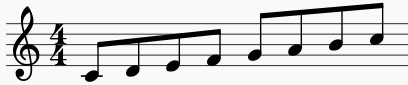
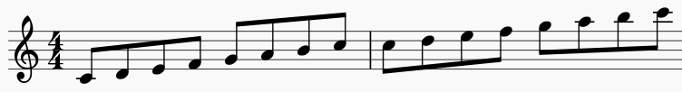
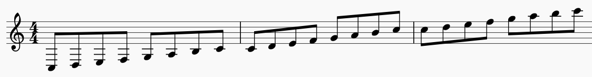

# Midi Wars

Midi Wars is a cross-platform desktop application that translates midi data to key presses. It is especially useful for playing instruments inside video games.

It has a very clean, non-intrusive, minimal User Interface - in fact, it doesn't even have a UI for the most part! One of the key aspects of Midi Wars is its CLI like interface. Simply open the in-game chat, type the respective command, and let the app do its thing.

*Frequently Asked Question* and *Troubleshooting* can be found in the [wiki](https://github.com/tirafesi/MidiWars/wiki).

## Table of Contents

* [Introduction](#midi-wars)
* [Features](#features)
* [Requirements](#requirements)
* [Restrictions](#restrictions)
* [Recommendations](#recommendations)
* [Setup](#setup)
* [Usage](#usage)
* [Playlists](#playlists)
* [User Interface](#user-interface)
* [Bugs & Suggestions](#bugs-&-suggestions)
* [Contributing](#contributing)
* [Donations](#donations)
* [Download](#download)
* [Disclaimer](#disclaimer)

## Features

* Play any song inside your favorite game using its instruments.
* Create playlists.
* Intuitive Music Player like controls, with support for keyboard media keys. \*
* Type in chat while playing. *(yes, that's right! - you can actually type in chat and talk to people while your character plays music!)* \*\*
* Non-intrusive, CLI like interface.
* Warning system, letting you know if your midi files have any problems.
* And many more...

<sub><sup>\* Only available on Windows.</sup></sub>  
<sub><sup>\*\* Only available on Windows. This functionality is **not stable** - don't expect to type as fluidly as the regular chat.</sup></sub>
## Requirements

* Java Runtime Environment 9 or higher

## Restrictions

* Songs should be in the key of *C Major*.
* Songs should not contain any *accidentals* (*i.e.* should only contain notes from the *C Major* scale).
* Midi Wars only supports up to 3 octaves. Songs targeting instruments that can play one, two or three octaves should only contain the following notes, respectively:

|  |  |  |
|:----------:|:-----------:|:-------------:|
| one octave | two octaves | three octaves |

## Recommendations

* Launch Midi Wars **after** you're already inside the game. The app might have trouble detecting the game window otherwise.

* Run the game in *Windowed Fullscreen*.

- Don't use *any* modifier keys (Shift, Ctrl, Alt, etc) for game actions (dodging, jumping, flying, etc). Otherwise, you might find yourself doing those actions if you press those keys while typing in chat and playing a song at the same time.

## Setup

Midi Wars translates midi data into sets of octaves, called *keybars*, and only one can be active at any given time.

Let's say you're currently playing the note *B4*. That means the current active keybar supports the notes from *C4* to *C5*. If you wanted to play the note *B5*, the app would first have to change the active keybar, resulting in the new active keybar supporting the notes from *C5* to *C6*.

### Key Bindings

In order for Midi Wars to work properly, you need to change your in-game key bindings to the following:

| Scale Degree | Ⅰ | Ⅱ | Ⅲ | Ⅳ | Ⅴ | Ⅵ | Ⅶ | Ⅰ | Keybar Down | Keybar Up |
|:-:|:-:|:-:|:-:|:-:|:-:|:-:|:-:|:-:|:-----------:|:---------:|
| **Key Binding** | 1 | 2 | 3 | 4 | 5 | 6 | 7 | 8 | 0 | 9 |

**Note:** The above keybinds are all *Numpad Keys*. If you don't have a *Numpad* in your keyboard, use an *on-screen keyboard* to set the in-game key bindings.

In addition to those, if you're using the Windows version of Midi Wars, set `Enter` to open the chat and `Esc` to close it.

### Config.xml

Midi Wars makes use of a configurations file for its basic settings, *config.xml*.

You can manually create this file if you want to, otherwise, it will be created for you when launching the app. Note that if you choose the latter, the app will fail to launch, since it needs a valid window title. In this case, simply edit the newly created configurations file and then launch the app again.

By default, midi files should be located in the same folder as the app itself, but you can change this behaviour by editing the configurations file.

```
<?xml version="1.0" encoding="utf-8"?>
<config>
    <windowtitle>TITLE OF TARGET WINDOW HERE</windowtitle>
    <midipath>.</midipath>
    <octavecd>200</octavecd>
</config>
```

* `<windowtitle/>` The title of the target window (usually the game window). Midi Wars will only be active while the title of the *foreground window* matches this value.
* `<midipath/>` The path where midi files are stored. Can be an absolute path or a path relative to the location of the app. By default, midi files should be located in the same folder as the app itself.
* `<octavecd/>` The cooldown between octave changes (ms). Sometimes, in-game instruments will have cooldowns associated with octave changes. Change this value to match whatever instrument you're using. By default, this value is 200ms.

## Usage

### Windows

* Launch the game.
* Launch Midi Wars by double clicking on it.
* Press *Enter* while inside the game and type your desired command. Commands should start with `/mw`.

Syntax: `/mw [command]`

Examples:

* `/mw play myplaylist.xml`
* `/mw canplay "my file name.mid"`

### Linux and MacOS

* Launch the game.
* Open a terminal and type `java -jar MidiWars.jar [command]`.
* Switch focus to the game window.

Examples:

* `java -jar MidiWars.jar play myplaylist.xml`
* `java -jar MidiWars.jar canplay "my file name.mid"`

### Commands

* `play <filename>` Plays the given midi file or playlist.
* `canplay <filename>` Checks if the given midi file can be properly played.
* `pause` Pauses playback. Resumes from the same position later.
* `stop` Stops playback. Resumes from the start of the song later.
* `resume` Resumes playback.
* `next` Plays the next song in the playlist.
* `prev` Plays the previous song in the playlist.
* `quit` Stops the execution of Midi Wars and exits.

**Note:** `pause`, `stop`, `resume`, `next` and `prev` commands can be used through *media keys* on the keyboard. These commands are **only available on windows**.

## Playlists

Playlists can be created through the use of `.xml` files.  Besides the obvious listing of songs to play, playlists can also have two extra options: repeat and shuffle modes.

```
<?xml version="1.0" encoding="utf-8"?>
<playlist>
    <repeat/> <!-- remove this if you don't want to repeat -->
    <shuffle/> <!-- remove this if you don't want shuffle mode on -->
    <midifile>first.mid</midifile>
    <midifile>second.mid</midifile>
    <midifile>third.mid</midifile>
</playlist>
```

## User Interface

Besides the CLI like interface explained above, Midi Wars has two more interface elements: the warning system and the system tray icon.

### Warning System

The warning system is used to warn you when the midi file you are trying to play has some kind of problems (tempo too fast, impossible notes, etc). It is also used to let you know of any errors that occur during execution.

### System Tray (windows-only)

The system tray icon serves as an assurance that your actions aren't being monitored outside the game, since Midi Wars works basically like a key logger.

Therefore, the icon changes based on whether it is currently listening for key presses or not. The icon should **only ever be green while the game window is in the foreground**, meaning the keyboard hook is installed. **At any other time, the icon should be red**, meaning the keyboard hook is **not** installed.

## Bugs & Suggestions

Found a bug or have a suggestion?

Create a [new issue](https://github.com/tirafesi/MidiWars/issues/new) and I'll be sure to review it!

## Contributing

If you'd like to contribute to the project, feel free to submit a pull request with your changes.

You're also welcome to send me an e-mail with any questions you might have.

If you're an artist looking to contribute, send me an e-mail with some work samples. I'd love to have some decent looking icons for the system tray. *(since the icons I made are basically just a colored circle! heh)*

## Donations

Donations of any kind are **not needed** to keep Midi Wars running.

If you'd still like to show your support, feel free to gift me *Guild Wars 2* related stuff. I'd be especially grateful for receiving musical instruments or activation keys for the full game and its expansions, since I only own a free account.

*A simple e-mail with a thank you note would also be greatly appreciated!*

**Region:** Europe  
**IGN:** Nanasshie

## Download

Head over to [releases](https://github.com/tirafesi/MidiWars/releases) and download the most recent version from there.

Midi Wars automatically checks for updates on start, so you'll always be notified when a new version is available.

## Disclaimer

*Midi Wars is not related to any individual, company, software product or any other entity besides itself and its developer.*

*Midi Wars and its developer are not responsible for any harm or damage, of any kind, that may result from the use of Midi Wars. This includes, but is not limited to, hardware malfunctions, account suspensions and account bans.*

*Furthermore, Midi Wars and its developer hold no responsibility, of any kind, over the actions of those using Midi Wars.*

*Use at your own risk.*